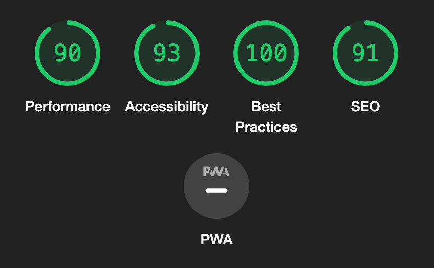
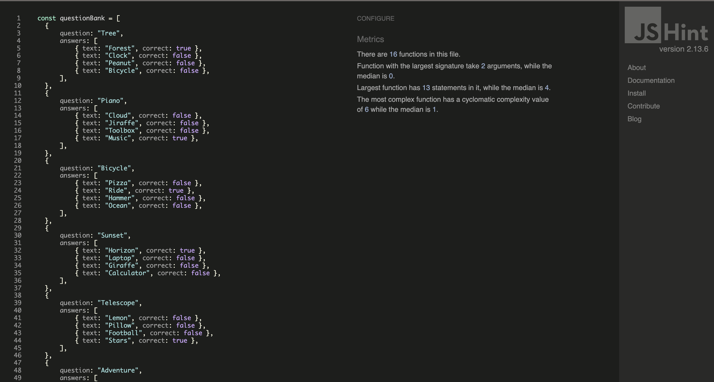
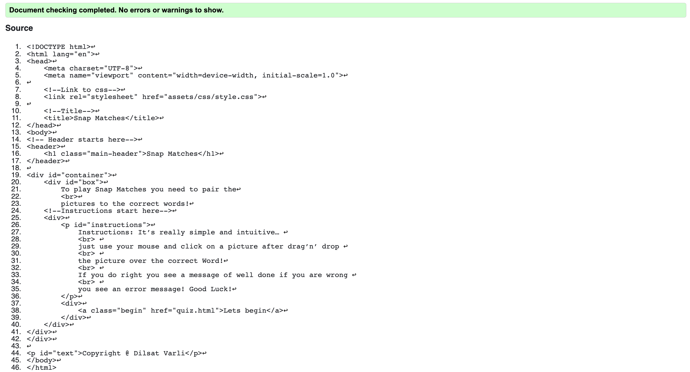
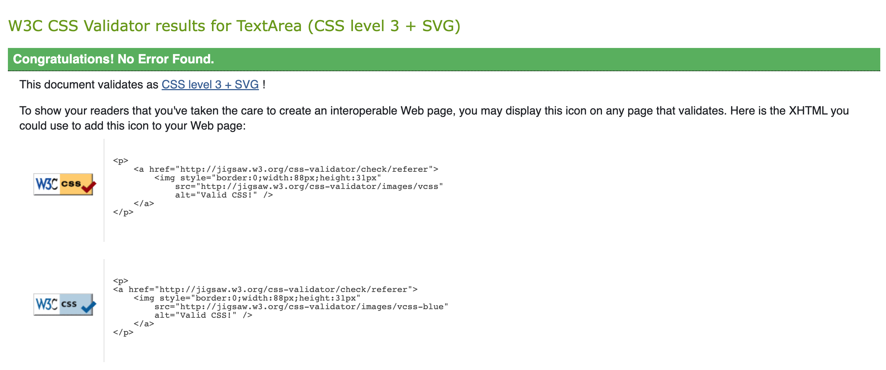
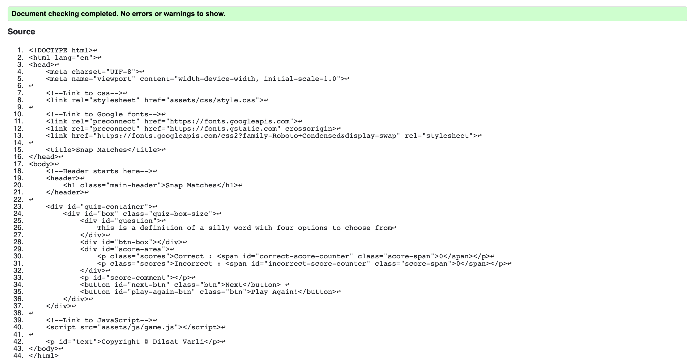

# Snap Matches

[View the website here] https://dilsv.github.io/Snapmatches/

## Introduction 

This website has been produced to provide a platform for a fun and interactive game designed for ages 11+. It offers a quiz method to test the user's response time.

In addition to the home page this website also features:
- The 'Quiz' page
- A 'Instructions section'
- An 'Overall score section'

The business goals of the website is:
1. To provide an interactional and enjoyable game designed for ages 11 and above.
2. To provide content that is fun and interactional whilst playing the quiz.
3. To create a website that is easy to navigate with simple instructions to play the game.

The user goals of this website is:
1. To engage and allow the user to use common knowledge when using the website.
2. To create an educational platform for all ages.
3. To improve previous scores & overall knowledge.

--- 
## UX

### Strategy
Using the core UX principles I first started with Strategy, thinking about the target audience for this quiz & the features they would want.

The target audience for 'Snap Matches' are:
- People aged 11+
- People who are interested in problem-solving.
- People who want to improve test their good sense. 

Features that they would need to be included:
- A fun & interactive quiz.
- The ability to track their overall scores so they can see if they're improving.

It was important to me that this website was simple, easy to navigate, use to to ensure all users had an enjoyable experience hence, each page was designed with minimal information and naviation using simple language.

The website has been designed to work well on desktops, tablets and mobile, to ensure that no matter the device the user has a positive user experience.

### Scope
To achieve the desired user and business goals this website will include the following:
1. A landing page with:
- A `H1` heading
- An instructions 'div`
- Start game button
- A "Lets Begin!" button

2. Quiz Page:
- A `H1` heading
- Question counter
- A score count 
- Quiz questions
- 4 answer options

3. End of quiz page:
- A `H1` heading
- An overall scoring
- Control buttons
- A 'Play Again!' button

### Structure
This is a multi-page website to keep the amount of information on each page limited and easy to digest; the rules, game and play again page are all separated so that anyone using the website can find what they want without struggle. Each page is designed with simplicity in mind, with a H1 element that returns the user home and the relevant content centred below; this simplicity will allow for users to feel comfortable using and navigating each page. The quiz itself has a question, and four possible answers to pick from. This layout will be responsive so that it isn't too cramped when being viewed on a smaller screen.

### Skeleton
`Home Page and Instructions`
[View wireframes here](assets/read.me-files/wireframes/main-page-wf.png)

`Quiz` 
[View wireframes here](assets/read.me-files/wireframes/quiz-page-wf.png)

`Play Again`
[View wireframes here](assets/read.me-files/wireframes/end-page-wf.png)

`iPad and mobile pages`
[View wireframes here](assets/read.me-files/wireframes/ipad-mob-wf.png)

I made a few changes to the design post creating the wireframes. These includes the responsiveness of the quiz boxes on a mobile screen and also directing the home page via the main title.

### Surface
I chose to use a background image of a retro gaming background. For the title, I chose a bright purple to make sure this was clear to read and bold. For the subheadings and footer, I chose purple to compliment the background but also for it to remain consistent. For any content text, I chose the colour black to make this stand out and easy to read. For any buttons, I chose to highlight these in the same purple to draw the user to them, and the text within them white. I feel that this colour palette is quite age-neutral and keeps the theme consistent, highlighting the element's that are important to the user which makes navigating the website easier. 

The font used is `Abel` and `Acme`. The font `Acme` is used as the main title and for the questions. The remaining elements are all in the font `Abel`. 

---
## Features 

### All pages
#### *Navbar*
The navbar features on all pages & is fully responsive and returns the user to the home page when clicked.

### *Title* 
All page titles are `H1` elements, they are centred and large in size so there is no visual difficulty as to which page the user is on. Clicking this will return the user to the Home Page.

### *Buttons*
All of the navigation buttons throughout the site are styled in the same way, using a bold black with opacity.

### Home page 

#### *Heading*
I decided to set the heading as a link directing users back to the home page. I opted for this approach to simplify navigation, making the quiz more user-friendly, especially for younger participants.

#### *Lets Begin button*
I wanted to keep this on the Home Page to make it easy for the user to find and the website easy to navigate. 

### Instructions
#### *Instructions list*
The list of rules is a `div` element, it has been styled to remain within the centre of the screen to allow for better responsivity but also make readability simple.

### Quiz
#### *Quiz elements*
The quiz is made up of the following: 
- Two progress items (question & score counts), which remain at the bottom of the quiz beneath the answer boxes.
- Question, this is dynamically created each time a new question is generated but always remains in the centre of the screen.
- Answer buttons, these are styled in a simple way to highlight the answer choices for the user playing the quiz.

### End page

### Score Page
#### *Amount of correct points scored*
The score point is a `div` element, it has been styled to remain in the centre of the screen to allow for better responsivity. The scores in this list are generated in `games.js` using local storage.

---
## Technologies Used
I have used several technologies that have enabled this design to work:

- [HTML](https://www.w3schools.com/html/)
    - Used as the basic building block for the project and to structure the content.
- [CSS](https://www.w3schools.com/css/)
    - Used to style all the web content across the project. 
- [JavaScript](https://www.udemy.com/course/professional-javascript-course/learn/lecture/36385806#overview)
    - Used for the responsive navbar, quiz functionality & sound effects ----.
- [Google Fonts](https://fonts.google.com/)
    - Used to obtain the fonts linked in the header.
- [Font Awesome](https://fontawesome.com/)
    - Used to obtain the icons used on the high scores and rules pages. ------------
- [Google Developer Tools](https://developers.google.com/web/tools/chrome-devtools)
    - Used as a primary method of fixing spacing issues, finding bugs, and testing responsiveness across the project.
- [GitHub](https://github.com/)
    - Used to store code for the project after being pushed.
- [Git](https://git-scm.com/)
    - Used for version control by utilising the Gitpod terminal to commit to Git and Push to GitHub.
- [Gitpod](https://www.gitpod.io/)
    - Used as the development environment.
- [Balsamiq](https://balsamiq.com/)
    - Used to create the wireframes for the project.
- [Grammarly](https://www.grammarly.com/)
    - Used to fix the grammar errors across the project. ----------
- [W3C Markup Validation Service](https://validator.w3.org/) 
    - Used to validate all HTML code written and used in this webpage.
- [W3C CSS Validation Service](https://jigsaw.w3.org/css-validator/#validate_by_input)
    - Used to validate all CSS code written and used in this webpage.
- [AmIResponsive](http://ami.responsivedesign.is/)
    - Used to generate responsive image used in README file. -------------
- [YouTube] (https://www.youtube.com/watch?v=PBcqGxrr9g8)
    - Used for guidance when writing JavaScript codes.
- [JSHint] (https://jshint.com/)
    - Used to validate JavaScript codes.
---
## Testing

### User Stories 
1. **As a first time user, I want to be able to navigate my way easily throughout the website.**
The navbar being placed right at the top of all pages allows the user to return to the home page at any point. To improve this in the future I would probably include an animation that points this action out to the user as some users may not know to click the Snap Mathes heading to return home.

2. **As a first time user, I want to have fun by playing a quiz game.**
In the quiz design, I incorporated visual indicators to signal users when they have answered a question correctly or incorrectly. This immediate feedback is intended to facilitate learning during quiz participation. Looking ahead, I believe it would enhance the user experience if, in the event of an incorrect answer, the correct response is also highlighted for added educational benefit.

3. **As a recurring user, I want to efficiently run the game with minimal mouse clicks**
Upon completing the quiz the user is taken to the end page, where they are able to see their score at the end of the game.

### Lighthouse
I used the Lighthouse report on Google Dev Tools to test my websites performance, accessibility and best practices. The results are as followed: 
.

I also tested my website in Google and Safari to ensure that my website worked on most browsers without any issues.

During the development of this project, I utilised Google Chrome Developer Tools, consulted W3 Schools and Stack Overflow for reference, and employed JSHint to address styling and alignment issues. JSHint efficiently pinpointed elements in need of adjustment, allowing me to instantly observe the effects of the changes. Moreover, the 'console.log()' function played a crucial role in confirming the proper invocation of my functions and ensuring accurate information display.

I tested the quizzes functionality by 'playing' it myself, to ensure the user experience was positive and that everything was working as it should. 

**Counting Error**
On all devices, when the user was playing the quiz it wasn't counting the 'Correct' and 'Incorrect' scores correctly, therefore I made sure my JavaScript function was calling the correct functions in order to carry this out accurately.

### Improvements

**'Lets begin!' button**
After attempting various approaches, I endeavored to make the 'Let's begin!' button identical to the 'Next' and 'Play again!' buttons in both the HTML and CSS codes. This bug surfaced toward the project's conclusion, prompting me to prioritise the correction of other code issues in my work.

**Decoration on Main title**
While incorporating the code to link the name 'Snap Matches,' an unintended underline decoration emerged. Despite multiple attempts to address the bug, I decided to prioritise enhancements to other sections of my code. I aim to avoid a similar occurrence in my next project.

**Hover effect on buttons**
While constructing my website and configuring the buttons to align with my intentions, I recognised that as a user, I would have found the experience more interactive with hover buttons. Although I didn't implement this feature in the current website, I plan to integrate it into my next project.

**Highscore and Timer**
I had intended to include a high score and a timer feature in my project. Before starting the website construction, I set the goal of ensuring a functional '.js' script webpage. Throughout the building process, I prioritised refining and perfecting my JavaScript file.

**Next button**
I had intended to make this button centered below the incorrect and correct score. Unfortunately, it gave bugs that was unresolvable as I addressed it later on in my project. I intend to make sure the buttons used will be fully functioning with the right CSS to give it the look I intend to.

### Validation: HTML, CSS and JavaScript
Furthermore, I used Jshint to ensure that there were no errors within any of my JavaScript code. Initially there were errors as you can see below:
![] --------------------------------------jshint 

However, I implemented all changes to ensure my code passed with no errors:

In addition to Jshint, I used Jigsaw to validate my HTML and CSS which pass with no errors:

In addition to my own testing, I enlisted the help of friends, family, and fellow students to evaluate the website on various devices such as phones, laptops, tablets, and desktops. Their feedback on any issues or discrepancies in functionality and appearance proved invaluable, allowing me to identify and debug issues that I might not have discovered otherwise.

---
## Deployment
I deployed this website by using GitPages and following the below steps:

### GitHub pages deployment

1. Log in to GitHub
2. In your Repository section, select the project repository that you want to deploy
3. In the menu located at the top of this section, click 'Settings'
4. Select 'Pages' on the left-hand menu - this is around halfway down
5. In the source section, select branch 'Main' and save
6. The page is then given a site URL which you will see above the source section, it will look like the following:

Please note it can take a while for this link to become fully active.

### Forking the GitHub Repository

If you want to make changes to your repository without affecting it, you can make a copy of it by 'Forking' it. This ensures your original repository remains unchanged.

1. Find the relevant GitHub repository
2. In the top right corner of the page, click the Fork button (under your account)
3. Your repository has now been 'Forked' and you have a copy to work on

### Cloning the GitHub Repository

Cloning your repository will allow you to download a local version of the repository to be worked on. Cloning can also be a great way to backup your work.

1. Find the relevant GitHub repository
2. Press the arrow on the Code button
3. Copy the link that is shown in the drop-down
4. Now open Gitpod & select the directory location where you would like the clone created
5. In the terminal type 'git clone' & then paste the link you copied in GitHub
6. Press enter and your local clone will be created.
---
## Credits
I have used several resources to produce this website.

The following websites/articles were used for research and guidance:

[Stack Overflow](https://stackoverflow.com/)

[W3Schools](https://www.w3schools.com/)

I obtained code from the following resources:

[Vanilla JavaScript quiz tutorial](https://www.youtube.com/watch?v=PBcqGxrr9g8)

[Helen Murugan](https://github.com/helenmurugan/true-words-quiz)

The below sources were used for content: 

[Google images](https://www.google.com/imghp?hl=en&ogbl)

[Quiz questions](https://chat.openai.com/)

[Instructions](https://play.google.com/store/apps/details?id=com.mapi.matchpicstowords&hl=en_GB&gl=US)

---
## Acknowledgements

I express gratitude to my course mentor, Sandeep Aggarwal, for his continuous support and guidance during the project. I also extend thanks to my friends from the CI Community, Harry Dhillon and Helen Murugan, for their assistance, feedback, and sharing examples of their completed submissions.

## Notes 

I had received my feedback for my initial Project 1 whilst starting this project. My aim in my initial P1 was to work on the guidelines of a Merit. This time I made sure to learn from the mistakes I had done in my P1 and not to make them again in this submission such as the amount of commits I made. I will strive to be better as each project approaches.